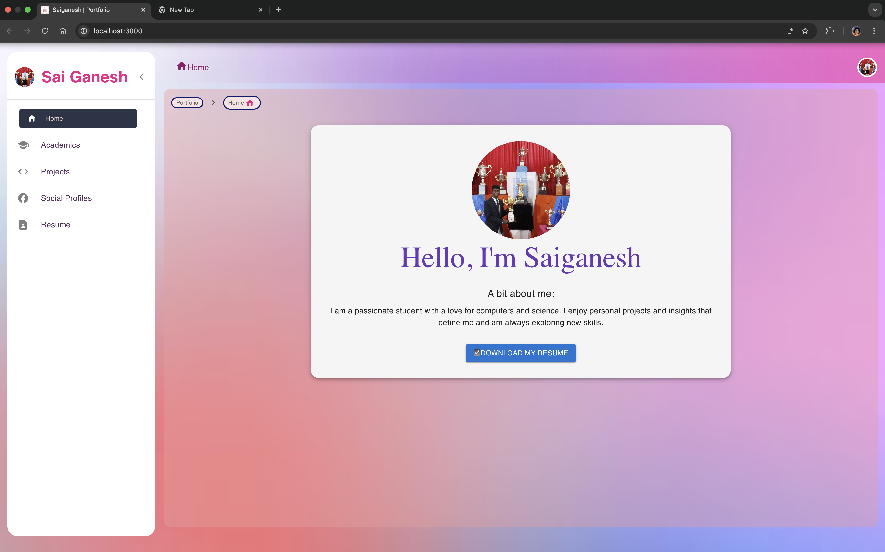
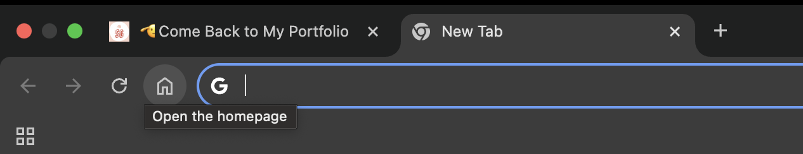
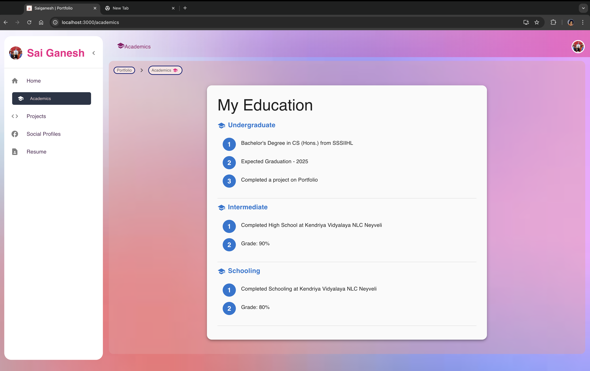
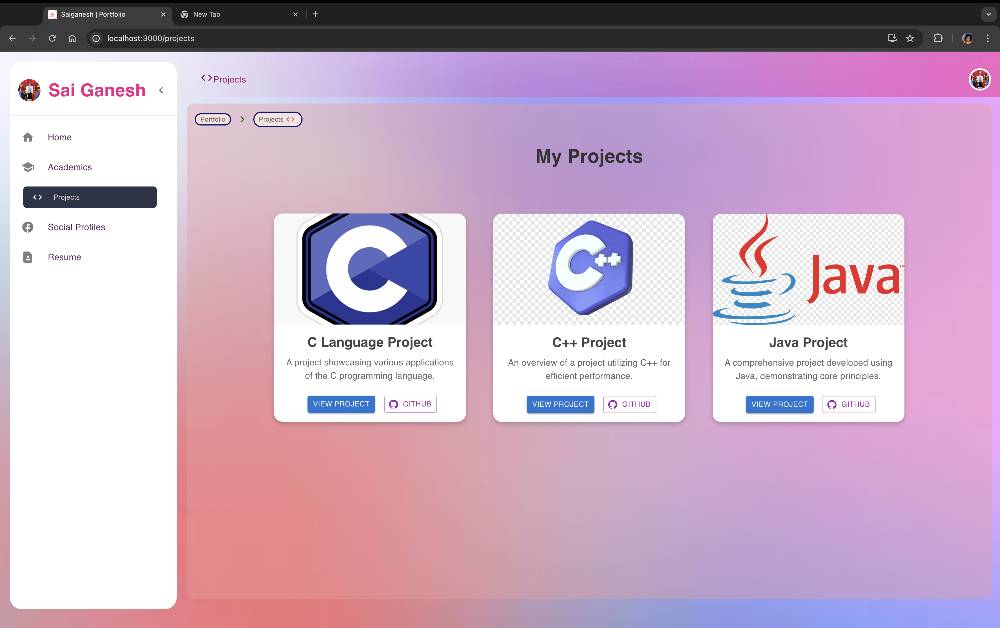

# Portfolio Project

This is a simple student portfolio website built using React, Material UI. It showcases personal projects, social profiles, academic background, and a downloadable resume.

## Table of Contents

1. [*Project Overview*](#project-overview)
2. [*Directory Structure*](#directory-structure)
3. [*Functionality Overview*](#functionality-overview)
4. [*Packages Used*](#packages-used)
5. [*Scripts*](#scripts)
6. [*Installation*](#installation)
7. [*Running the Project*](#running-the-project)

## Project Overview

This portfolio website showcases projects, social links, and an academic timeline. It leverages Redux to manage the state of the bottom navigation and utilizes localStorage to persist the selected navigation item. All MUI components have been customized using the sx property for enhanced styling.

The homepage features a Typewriter effect for dynamic text display, and routing between pages is facilitated by React Router DOM. Data fetching is handled using Axios, specifically in the PageNotFound component to demonstrate the concept, while other pages utilize static data from a Constants.js file located in the Utils folder.

## Front-End Directory Structure

```bash
root/
│
├── public/
│   ├── index.html
│   ├──	Behind_PXL_orgi.png 
│   ├── SaiGanesh_Resume.pdf
│   ├── LOGO.jpeg
│   ├── manifest.json
│   └── robots.txt
├── src/
│   ├── components/
│   │   ├── Academics.jsx
│   │   ├── BreadCrumbComponent.jsx
│   │   ├── Dashbord.jsx
│   │   ├── Home.jsx
│   │   ├── PageNotFound.jsx
│   │   ├── Profile.jsx
│   │   ├── SocialProfiles.jsx
│   │   └── Projects.jsx
│   │   ├── Resume.jsx
│   ├── redux/
│   │   ├── slices/
│   │   │   └── navSlice.jsx
│   │   │   └── systemSlice.jsx
│   │   └── store.js
│   ├── resources/
│   │   ├── css/
│   │   │   ├── dashbord.css
│   │   │   ├── home.css
│   │   │   ├── socialp.css
│   │   │   ├── profile.css
│   │   │   ├── projects.css
│   │   │   ├── shared_animation.css
│   │   │   └── shared.css
│   │   └── images/
│   │   │   	├── back.avif
│   │   │   	├── etc...
│   │   └── fonts/
│   │   │   	├── Trophy.ttf
│   │   │   	├── etc..
│   ├── Utils/
│   │   └── Constants.js
│   │   └── projectDetails.js
│   ├── App.css
│   ├── App.js
│   ├── App.test.js
│   ├── index.css
│   ├── logo.svg
│   ├── reportWebVitals.js
│   ├── setupTests.js
│   └── index.js
├── .gitignore
├── package-lock.json
├── pakage.json
└── README.md
```

## Functionality Overview

### Home Page

- Personalized greeting from Me
- Resume download button which is working

### Profile Page

- Links to social profiles

### Projects Page

- Grid of personal projects with descriptions and links

### Academics Page

- Timeline of educational background

### 404 Page

- Custom error page
- User data fetch (for learning express)

## Packages Used

- React
- Material UI
- GSAP animations
- React Router
- Redux Toolkit
- Typewriter-effect
- Axios

## Scripts

Runs the app in development mode

```bash
npm start
```

Builds the app for production

```bash
npm run build
```

Runs tests

```bash
npm run test
```

Checks code quality

```bash
npm run lint
```

## Installation

Clone the repository:

```bash
git clone https://github.com/Saiganesh224212/MainProject
```

Navigate to the project directories (Front-End and Backend):

```bash
#For Frontend
cd FrontEnd
cd PorfolioProject

#For Backend
cd BackEnd
cd server
```

Install dependencies:

```bash
npm install
```

## Running the Project

After installation, run the project locally(First run the Server, then run the FrontEnd):

```bash
#For Server
npn run nodemonRun

#For Frontend
npm Start
```

## Screenshots of the Running Webpage








